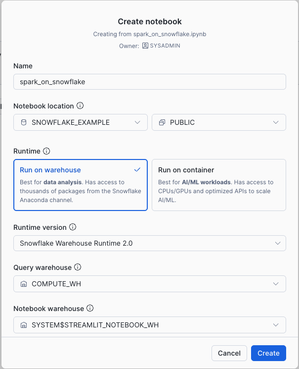

# Run Your Spark Code on Snowflake

> DEMONSTRATION PROJECT - EXPIRES: 2026-02-15  
> This demo uses Snowflake features current as of January 2026.  
> After expiration, this repository will be archived and made private.

**Author:** SE Community  
**Purpose:** Reference implementation for running PySpark code on Snowflake  
**Created:** 2026-01-16 | **Expires:** 2026-02-15 (30 days) | **Status:** ACTIVE

---

Your existing PySpark code, running on Snowflake's engine. No clusters. No data movement.

---

## Quick Start

### Option A: Snowflake Notebooks (No Setup)

1. Open <a href="https://app.snowflake.com" target="_blank">Snowsight</a>
2. Go to **Projects → Notebooks → Import .ipynb file**
3. Upload `notebooks/spark_on_snowflake.ipynb`
4. Configure the notebook settings:



   - **Runtime:** Run on warehouse
   - **Runtime version:** Snowflake Warehouse Runtime 2.0
   - **Query warehouse:** Any warehouse you have access to

5. Click **Create**, then **Run All**

That's it. The notebook runs on Snowflake's pre-configured environment.

---

### Option B: Local Jupyter

**Requires Python 3.10, 3.11, or 3.12** (Snowpark Connect constraint)

```bash
# Install Python 3.11 if needed (macOS)
brew install python@3.11

# Create environment
/opt/homebrew/bin/python3.11 -m venv .venv
source .venv/bin/activate

# Install dependencies
pip install snowpark-connect[jdk] jupyterlab

# Configure Snowflake connection
snow connection add --connection-name spark-connect

# Run notebook
jupyter lab notebooks/spark_on_snowflake.ipynb
```

---

## What This Shows

| Your Code | Runs On |
|-----------|---------|
| `spark.createDataFrame()` | Snowflake |
| `.filter()`, `.select()` | Snowflake |
| `.groupBy().agg()` | Snowflake |
| Window functions | Snowflake |
| `spark.sql()` | Snowflake |
| `.write.saveAsTable()` | Snowflake |

**Only change:** Replace `SparkSession.builder.getOrCreate()` with `snowpark_connect.server.init_spark_session()`

---

## Resources

- [Snowpark Connect for Spark](https://docs.snowflake.com/en/developer-guide/snowpark-connect)
- [Compatibility Guide](https://docs.snowflake.com/en/developer-guide/snowpark-connect/compatibility)
- [Migration Accelerator](https://docs.snowflake.com/en/developer-guide/snowpark-migration-accelerator)
